# Introducción a Unity

* **Alumno:** Adrián García Rodríguez
* **Correo:** alu0101557977@ull.edu.es

## Adición de objetos 3D básicos

Creamos un cubo 3D seleccionando la pestaña `GameObject > 3D Object > Cube`.

<video src="media/crear-cubo.mp4" title="Crear cubo" loop="true" muted autoplay></video>

Creamos una esfera 3D seleccionando la pestaña `GameObject > 3D Object > Sphere`.

<video src="media/crear-esfera.mp4" title="Crear esfera" loop="true" muted autoplay></video>

Creamos una cápsula 3D seleccionando la pestaña `GameObject > 3D Object > Capsule`.

<video src="media/crear-cápsula.mp4" title="Crear cápsula" loop="true" muted autoplay></video>

Creamos un cilindro 3D seleccionando la pestaña `GameObject > 3D Object > Cylinder`.

<video src="media/crear-cilindro.mp4" title="Crear cilindro" loop="true" muted autoplay></video>

## Adición en el proyecto del paquete Starter Assets

Primeramente, buscamos en el navegador la `Asset Store` y ponemos en la barra de búsqueda de la misma: *Starter Assets*.

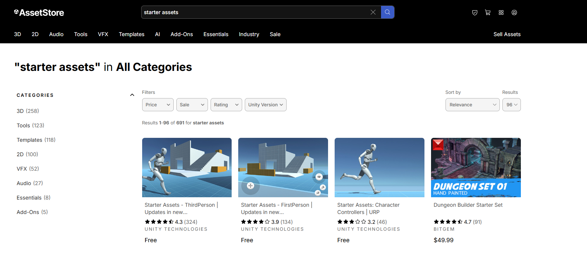

Seleccionamos el paquete `Starter Assets - ThirdPerson`, y pinchamos en *Add to My Assets*.

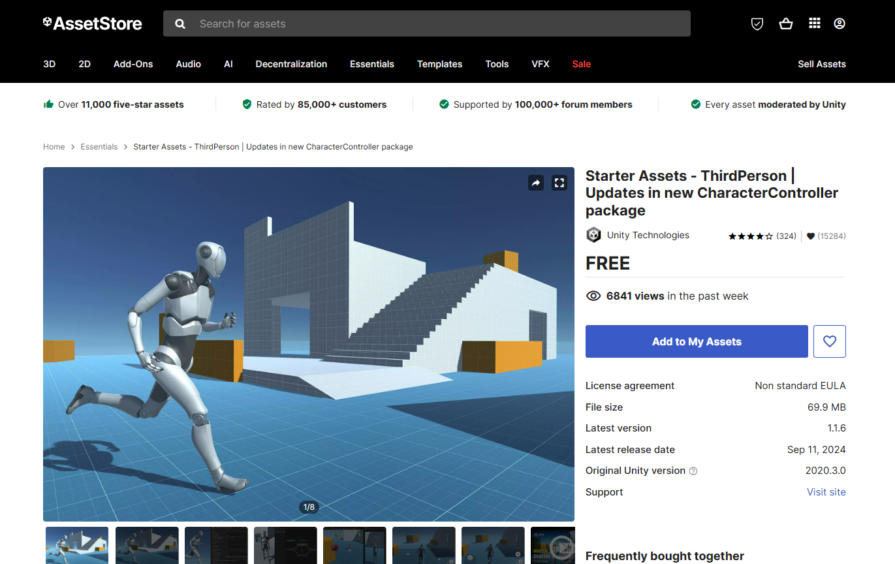

Todavía en la `Asset Store` vamos a la ventana de `My Assets`, donde confirmaremos la adición del paquete anterior.

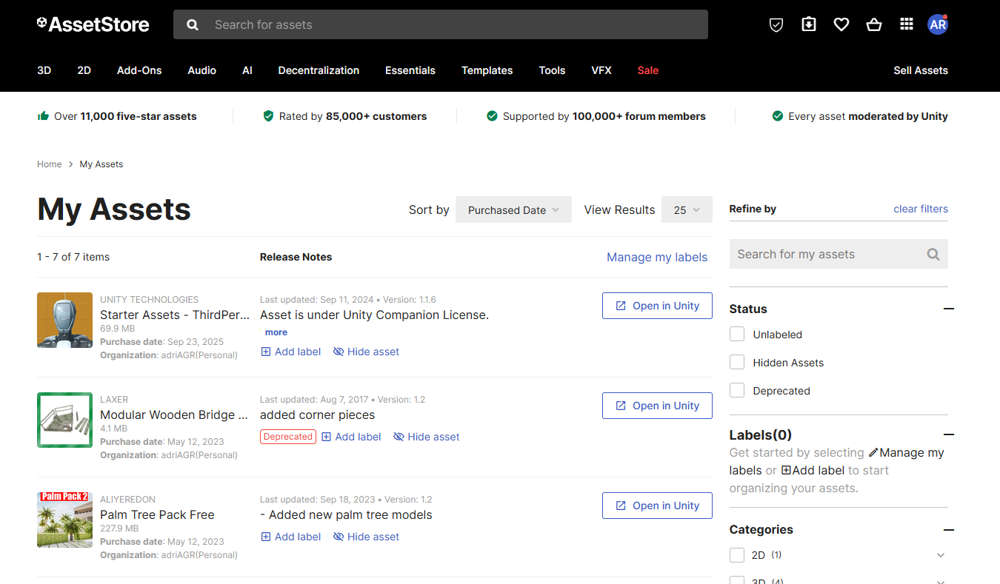

Ahora, entramos a `Unity` nuevamente, donde seleccionaremos la pestaña `Window > Package Management > My Assets`. En ese momento, se nos desplegará una ventana emergente, en la que tendremos que buscar el asset que deseamos incluir en nuestro proyecto.

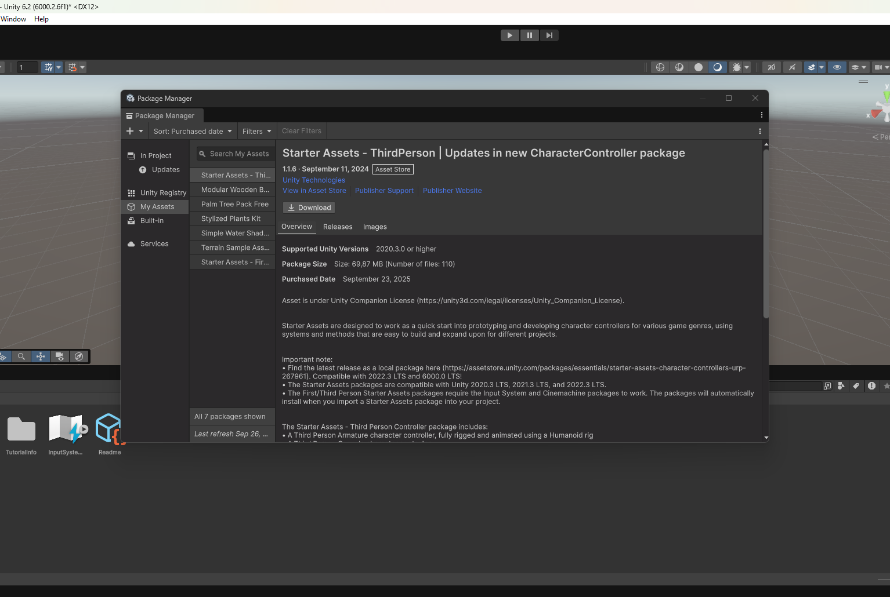

Finalmente lo descargaremos y lo importaremos a nuestro proyecto.

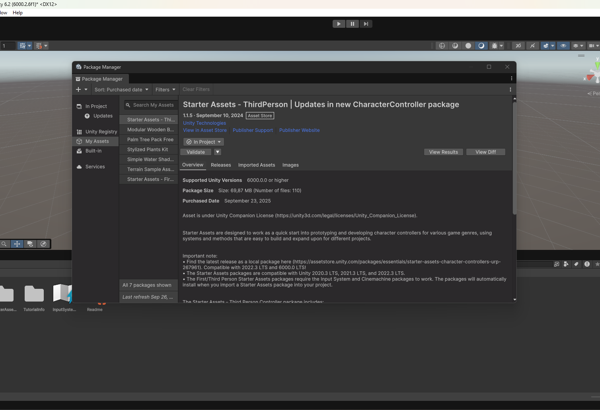

En la parte inferior de la interfaz de `Unity`, podremos observar el paquete importado.

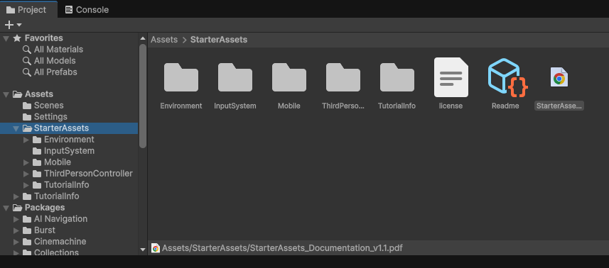

## Adición de un objeto libre de la Asset Store que no sea de los Starter Assets

En este caso, importaremos a nuestro proyecto 3 paquetes distintos de la `Asset Store`: `ZIL 130 Military truck`, `Zombie` y `Rock and Boulders 2`.

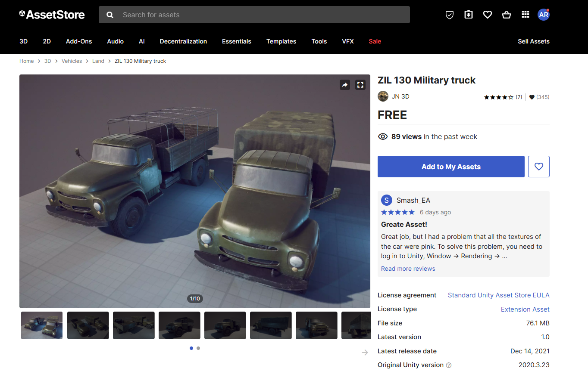

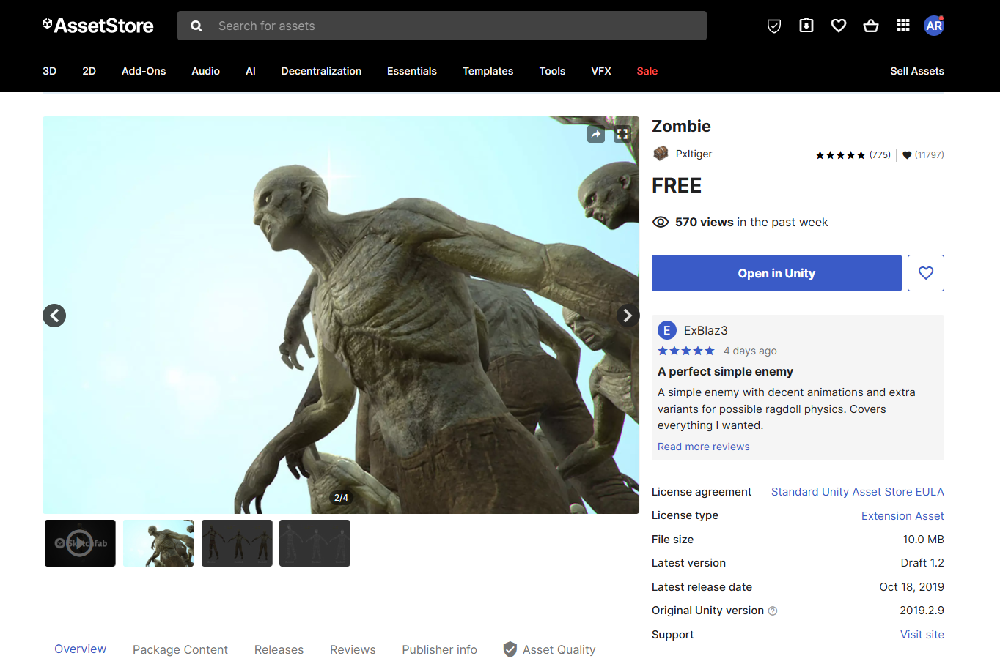

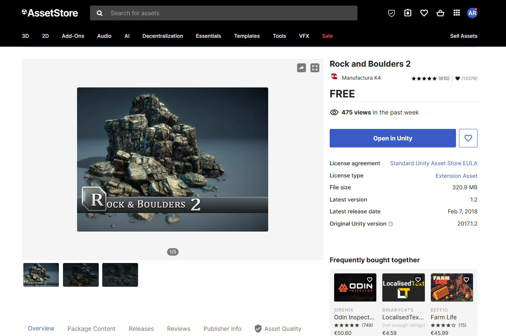

Para importar estos paquetes, seguiremos los pasos realizados en el apartado anterior. Una vez con los paquetes en nuestro proyecto, introduciremos en la escena un objeto de cada asset. Comenzaremos introduciendo un camión del paquete `ZIL 130 Military truck`, concretamente uno de los `prefabs`.

<video src="media/introducir-camión.mp4" title="Introducir camión" loop="true" muted autoplay></video>

Continuamos con el asset `Zombie`, donde introduciremos un `prefab` de zombie.

<video src="media/introducir-zombie.mp4" title="Introducir zombie" loop="true" muted autoplay></video>

Finalmente añadimos a la escena una roca del paquete `Rock and Boulders 2`, igualmente utilizando un `prefab`.

<video src="media/introducir-roca.mp4" title="Introducir roca" loop="true" muted autoplay></video>

## Creación de terreno

Para crear un terreno 3D seleccionando la pestaña `GameObject > 3D Object > Terrain`.

▶️ [Ver en YouTube](https://youtu.be/KN5LRlxzB1c)

A continuación, le damos relieve al terreno con la herramienta `Paint Terrain`.

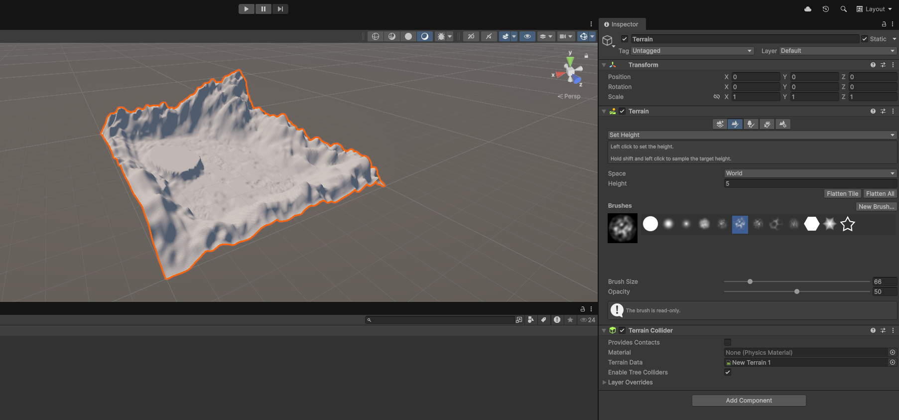

Agregamos algunas texturas naturales a fin de añadirle realismo al terreno con la herramienta `Paint Terrain` y la opción `Paint Texture`.

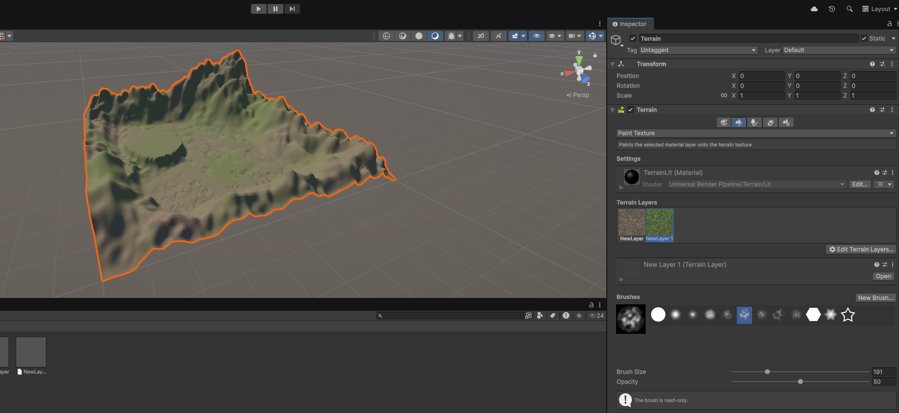

Por último, esparcimos algunos árboles a lo largo del terreno para darle más ambiente. Para ello, utilizamos la herramienta `Paint Trees`.

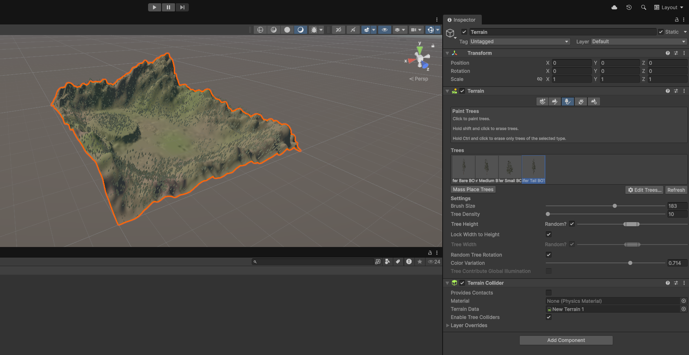

## Asignación de etiquetas a los objetos

Crearemos una etiqueta para cada objeto de la escena. Para conseguirlo, seleccionaremos cualquier objeto, y en el `Inspector`, pinchamos sobre el campo `Tag > Add Tag`. Entonces, se nos abrirá el `Tag Manager`, desde el que crearemos una etriqueta para cada objeto.

▶️ [Ver en YouTube](https://youtu.be/zw9-N0vqHsk)

Posteriormente, agregaremos la etiqueta correspondiente a cada objeto desde el `Inspector`.

▶️ [Ver en YouTube](https://youtu.be/W7Z_GUZt6Uc)

## Utilización del prefab del paquete Starter Assets - ThirdPerson

Primero, localizaremos el prefab deseado. En este caso, lo encontraremos en `Assets > StarterAssets > ThirdPersonController > Prefabs > NestedParentArmature_Unpack`. Una vez localizado, arrastraremos el prefab a la escena.

▶️ [Ver en YouTube](https://youtu.be/JU43QikPzr8)

Por defecto, el prefab incluye un panel de controles para móviles. Como en nuestro caso controlaremos al personaje mediante el teclado, desactivaremos este elemento: `UI_Canvas_StarterAssetsInputs_Joysticks`.

▶️ [Ver en YouTube](https://youtu.be/AcErZlJEmCQ)

## Adición de un script que escriba en la consola la etiqueta y posición de cada objeto que hayas utilizado. 

Creamos un script vacío en C# en la carpeta `Assets`, seleccionando la pestaña `Create > Scripting > Empty C# Script`.

▶️ [Ver en YouTube](https://youtu.be/HCnmz3nUitE)

Programamos el script para que al inicio del juego se imprima por consola la etiqueta del objeto y su posición.

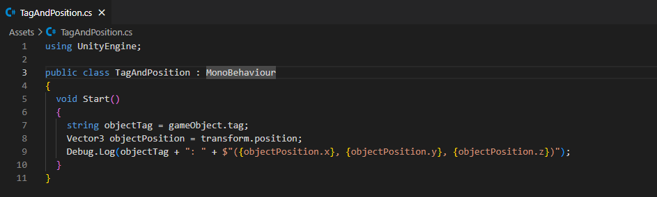

Asignamos el script creado a cada objeto: en el `Inspector` seleccionamos `Add Component` y escribimos el nombre del script.

▶️ [Ver en YouTube](https://youtu.be/iGfUyCPJkhs)

Ejecutamos el juego a fin de comprobar si el script funciona.

▶️ [Ver en YouTube](https://youtu.be/v37VyPfYtcI)

Asimismo, incluiremos un script específicamente para el personaje. Este script mostrará al inicio del juego la etiqueta y la posición del jugador. Además, cada vez que se mueva, se imprimirá nuevamente por consola la etiqueta y la nueva posición del mismo.

Ejecutamos el juego con el objetivo de comprobar si el nuevo script funciona.

▶️ [Ver en YouTube](https://youtu.be/fAdRpqfWfHs)

## Ejecución del juego

▶️ [Ver en YouTube](https://youtu.be/odVaqTvgGlM)